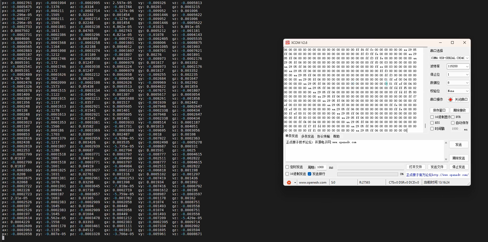

# 树莓派&&T265--数据读取与串口传输

在树莓派上部署好T265后，有多种方式可以调用T265的数据信息，例如使用ROS调用，使用python、C++通过SDK提供的API调用。

这里使用C++调用SDK API的方式来获取数据信息。

具体实现方式源代码中注释写的很详细，这里不对代码进行分析，只介绍大概思路和具体实现过程。

## 使用C++调用SDK数据并进行输出打印

首先需要解决如何获取SDK数据的问题,

一个快速了解SDK中API的使用方法是直接翻看官方例程：[官网例程](https://dev.intelrealsense.com/docs/rs-hello-realsense) (这里主要看C/C++版，想用python的也可以自己看)

通过例程给的代码可以很快的学习到如何调用API获取数据，只需要将获取到的数据直接使用cout就可以在终端查看到输出。

如果想要查看到图像数据则可以安装编译OpenCV库来处理图像数据，OpenCV库的安装直接参照官方文档的教程操作就好（编译过程需要很长时间，要耐心等待）：[OpenCV在Linux上的安装教程文档](https://docs.opencv.org/4.x/d7/d9f/tutorial_linux_install.html)

## 操作树莓派的GPIO实现串口通信

### GPIO的调用

使用 `wiringPi`这个库可以对树莓派的GPIO口进行一系列操作，安装方法参照 `wiringPi`的官方文档：[Raspberry Pi | Wiring](http://wiringpi.com/download-and-install/)

使用wiringPi操作树莓派的gpio这个方法在Ubuntu22.04桌面系统上实测是可行的，其余方法则需再行摸索。

### 使用串口将T265的数据传输到其它设备

如果只需要打印到上位机看数据则直接使用 `wiringPi`中的 `serialPrintf`函数打印原始数据就好了。这里需要将数据编辑成一定格式之后再传输给单片机来进行通信，需要将原本的float数据转换成int类型，再转换成十六进制的形式，并且每一个数据都需要传输其高八位数据和低八位数据，且一次数据传输需要以特定的针头开始，以特定的针尾截止。

数据格式如下：

`<0xaa 0x29 0x05 0xff 0x06 高八位 低八位 高八位 低八位 ____ ____ ...... 0x00>`

前五个为针头，最后一个为针尾。

故代码中有一部分是对数据数组进行操作。

树莓派本身含有两个串口一个是mini串口，一个是硬件串口，关于其介绍和具体需要进行的操作请参照这两篇文章：

[树莓派 gpio / 串口通信_树莓派串口通信_aworkholic的博客-CSDN博客](https://blog.csdn.net/wanggao_1990/article/details/103702563)

[树莓派4B没有serial0或ttyS0，serial0没有映射到ttyS0，serial0和serial1调换映射_树莓派ttys0_红衰绿老的博客-CSDN博客](https://blog.csdn.net/qq_41208487/article/details/120863092)

